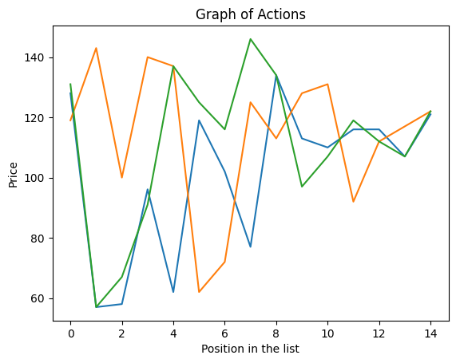
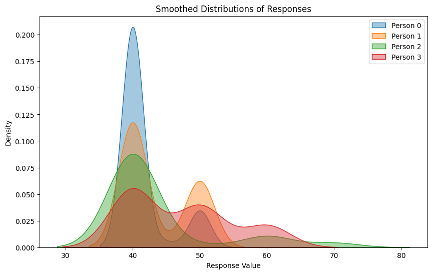
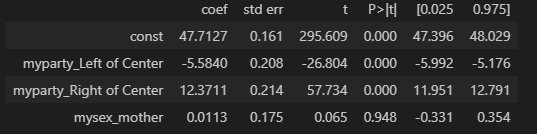

# Econ Agents Project

This is a project using LLMs to act as econ agents in various simulations. As of now only the supply and demand and ultimatum experiments are available. The loss aversion notebook is coming soon. You can see excerpts from all at wwww.jeremiah-richey.com

The supply and demand is a simple experiment where there are buyer and seller agents with some values or costs associated with each unit, and they go randomly and can make an offer or accept an existing one. They are told their values/costs and the existing offers and the past accepted prices of sales. The aim is to see if agents can work realistically within simple economic simulations. 

The ultimatum game is, for now, just experimenting with the offer side. So the agent is told there is 100 dollars and they can choose how much to keep and the other player will be offered the rest. If the other agent takes it they keep the money, else they both get zero. This is to see if agents act differently with different personas which are randomly assigned; each persona plays the game 50 times in the runs. 

## Contents

Supply_and_Demand_Eq_Experiment.ipynb

my_Ultimatum_experiment.ipynb

## Excerpt of Results

The supply and demand is set up so the theoretical equilibrium is about 115, and here you can see in three different runs the agents quickly find the equilibrium:

The ultimatum game results show that the agents do in fact act differently depending on their personas:

